# Implementation

We implement a series of monitoring policies in order to monitor calls to the `fillText()` method on a specific canvas element. Monitoring this deeper level call is crucial as a malicious canvas fingerprinter may counter a higher level policy enforcement.

At the higher level it is possible to monitor calls to `document.getElementByID()` and enforce the canvas poisoning policy whenever a suspicious canvas element is modified. However, this method has a trivial loophole as a canvas poison applied prior to the malicious canvas generation permits the malicious code to clear the canvas, undoing our poisoning. Instead, we choose to monitor the `fillText()` method, which is called by the attacker to draw the text used for fingerprinting.

## Canvas Poisoning

Canvas poisoning is the slight modification of a canvas element to alter the data generated, but
avoid major alterations to the percieved image. We believe this has strong potential to randomize
the fingerprints generated over time. The fingerprint generated one day will be different the next.
Thus our mitigation approach is to "hide in the crowd".

Source: <https://link.springer.com/content/pdf/10.1007/978-3-030-22038-9_3.pdf>
On Fig. 3a without the canvas poisoner, the surface of the orange background
is uniform and all pixels have the exact same color values. On Fig. 3b, the canvas
poisoner modifies the RGB values and the Alpha channel of the defined pixels
and it creates a unique rendering at every execution.
Because of these non-organic changes produced by these different mechanisms, we consider a device as an outlier if more than 8 canvas changes were
observed during the given time period. These represent less than 4% of our dataset.

### Canvas Examples

Drawing a Canvas Element

```javascript
var canvas = document.getElementById("drawing");
var context = canvas.getContext("2d");
context.font = "18pt Arial"; 
context.textBaseline = "top"; 
context.fillText("Hello, user.", 2, 2);
```

Using the canvas element to fingerprint a user:

```javascript
var canvas = document.getElementById("drawing");
#TODO: add example here
```

## Monitors

Our implementation relies on three monitoring functions enabled by the MyWebGuard extension, an Inline Reference Monitor for the web.

**Monitor 1**: Monitor calls to `document.getElementByID()`, allowing us to monitor each canvas element.

**Monitor 2**: Monitor calls to the `getContext()` method on the canvas elements identified by **Policy 1**, allowing us to access the specific canvas drawing context.

**Monitor 3**: Monitor calls to the `fillText()` method on each context returned by **Policy 2**, allowing us to strategically poison the canvas.

## Policies

We have come up with three policies that will be used to determine which canvas elements will be poisoned. If a canvas element is defined as malicious by one of our policies, it will be poisoned.

1. XY-position: Any canvas element that is not within the visible area of a webpage will be assumed to be malicious.
2. Z-axis position: Any canvas element with a negative Z-axis, meaning it is positioned behind the webpage and not visible, will be be assumed to be malicious
3. Code origin: Any canvas element being rendered by code from an origin that we have listed as untrusted will be assumed to be malicious.

## Diagram

We have created a flow chart to illustrate the process required to track the `fillText()` function:



## Action Items

- Implement the policies:
  - `document.getElementByID()` policy
  - `getContext()` policy
  - `fillText()` policy
- DONE: Implement a canvas poisoner
- Add blocklist to the `originAllowed` function (as a treat)
- Test implementation
- Final report and presentation
