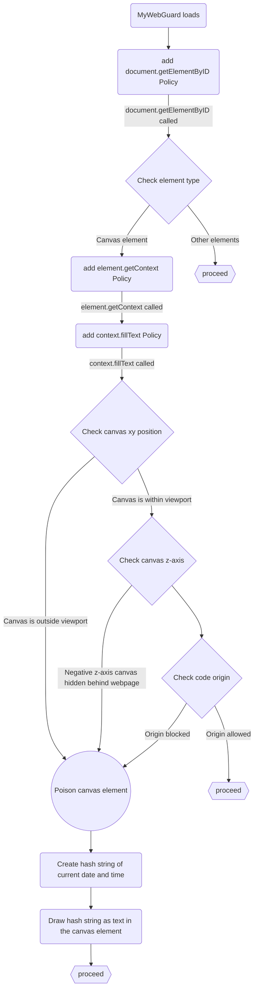

# Implementation Flowchart

```mermaid
flowchart TB
   mwg(MyWebGuard loads)
   id(add document.getElementByID Policy)
   ctx(add element.getContext Policy)
   ft(add context.fillText Policy)
   poison((Poison canvas element))

   mwg --> id
   id -->|document.getElementByID called| d1{Check element type}
   d1 -->|Canvas element| ctx
   d1 -->|Other elements| p1{{proceed}}
   ctx -->|element.getContext called| ft
   ft -->|context.fillText called| d2{Check canvas xy position}
   d2 -->|Canvas is outside viewport| poison
   d2 -->|Canvas is within viewport| d3{Check canvas z-axis}
   d3 -->|Negative z-axis canvas hidden behind webpage| poison
   d3 --> d4{Check code origin}
   d4 -->|Origin allowed| p4{{proceed}}
   d4 -->|Origin blocked| poison

   poison --> hash(Create hash string of current date and time)
   hash --> draw(Draw hash string as text in the canvas element)
   draw --> p5{{proceed}}
```
