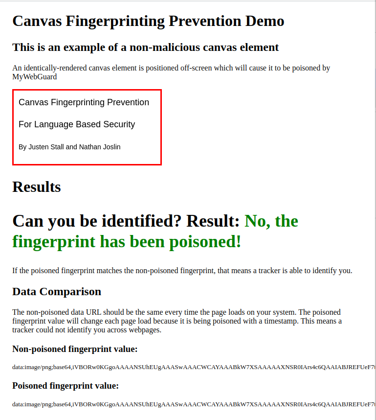
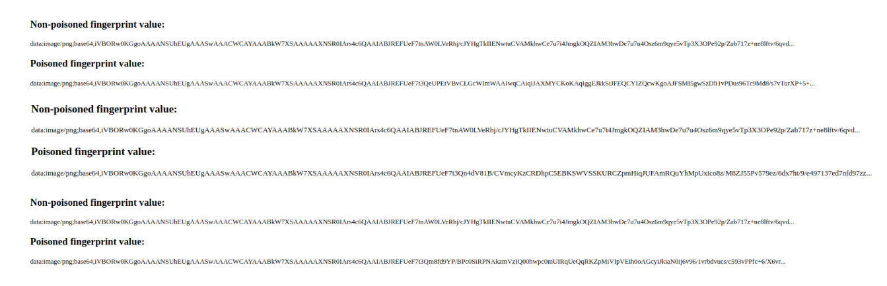

# Course and Instructor information

- Course: CPS 574 - Language Based Security
- Instructor: Dr. Phu Phung
- TA: Ruthvik Kolli

## Team Project: MyWebGuard

Trello Workspace: [MyWebGuard Trello](https://trello.com/b/ItvCIIq7/mywebguard)

Bitbucket Repository: [MyWebGuard Bitbucket](https://bitbucket.org/ss-lbs-f22-team8/mywebguard/src/master/)

### Team Members

- Nathan Joslin - <joslinn1@udayton.edu>
- Justen Stall - <stallj2@udayton.edu>

## Project Summary

Browser fingerprinting is the technique of collecting attributes associated with a device. These attributes are combined to form a unique identifier, a fingerprint, which may be used for tracking or identification. A fingerprint of one device will differ from another as a result of software and hardware configurations. Fingerprinting methods have been shown to be used in industry as an additional layer of fraud protection. When logging in, user provided login credentials are verified as well as the device being used. As an unrecognized device is an indicator of suspicous activity, extra verification measures can be enforced to validate the user request. However, fingerprinting methods could just as easily be used by malicious actors. A third-party can collect device fingerprints to track user activity across the web without the user being aware of it. We consider this involuntary tracking and collection of private data to violate user privacy. By using MyWebGuard's enforcement technology we are able to successfully mitigate the ability for malicious actors to track user activity across the web. More specifically, we mitigate the possibility of canvas fingerprinting by taking a "moving target" approach. This approach is similar to methods used by the Tor browser, which is known for protecting user privacy.

## Introduction

Although device fingerprinting is used positively in the wild and in research, it is possible for device fingerprinting to be used maliciously. In _An Empirical Evaluation of Web-Based Fingerprinting_ Khademi et al. outline a scenario where device fingerprinting may be used in conjunction with social media to unveil the person using the device.

1. A user logs onto website A using facebook credentials.
   - Website A has access to their _public_ information.
2. Website A fingerprints the user's device, linking their facebook profile to the device fingerprint.
   - This fingerprint:profile link is stored in a database.
3. Website A then shares the fingerprint database with Website B.

4. Website B uses the same fingerprinting algorithm as Website A.
   - The same fingerprint should be generated.
5. Website B identifies the user by querying the database.
   - User's public facebook profile information is revealed.

Using this method, the ability for a user to be tracked is dependent on the number of websites sharing the database. Scenarios such as the one provided by Khademi et al. are the motivation for our work.

In order to mitigate malicious fingerprinting activities we first needed a concrete understanding of browser/device fingerprinting, how it is used, how effective it is, and how common it is used. We collected and examined research papers that surveyed the prevalence of fingerprinting in the wild as well as the methods used. In sum, it is known that some of the Alexa top 1M websites use browser or device fingerprinting. The specific number of websites is hard to determine as it is often difficult to differentiate between functional use of API's and using API's for fingerprinting. This is the main research question as currently many anti fingerprinting technologies result in frequent major or minor website breakage. Furthermore, many of these studies examined the effectiveness of fingerprinting methods. It can be seen that some fingerprinting methods are more effective than others. For example it appears that the User-agent, Canvas, List of Plugins, and List of Fonts attributes of a device provide the most unique fingerprints. Combining multiple high entropy attributes to form a single fingerprint yields an increasingly unique fingerprint. Laperdrix et al. provide a table demonstrating the entropies for device attributes determiend by three other research papers, see Figure 1.  

Due to time constraints it was necessary to reduce the scope of our research project. Therefore, due to its prevalence and high entropy, we decided to narrow down our research to primarily focus on canvas fingerprinting. We researched fingerprinting methods that primarily focused on using canvas elements to uniquely identify users. From these methods we were able to design and implement a policy enforced by MyWebGuard that, in theory, successfully mitigates the ability for a canvas fingerprinter to consistently identify a user over time. We achieved this by implementing a method called "Canvas Poisoning". If our policy flags a canvas element as suspicious, i.e. the canvas element is being created by the fingerprinting algorithm itself, we "poison" the canvas image. Canvas poisoning slightly changes a canvas image so that is is similar to the original image but the data for the element is different from the original image. Because the image data is changed from the original data, the resulting fingerprint is also different. As a fingerprinter relies on a consistent fingerprint over time to track a given device or user, slightly changing a devices fingerprint each time it is collected significantly limits the effectivness of the fingerprinting algorithm. Figure 1 provides an example of canvas poisoning.  

Figure 1:  

 

## Background & Research

Device fingerprinting is the technique of collecting attributes associated with a device. These attributes are combined to form a unique identifier, a fingerprint, which may be used for tracking or identification purposes. In this way, a device fingerprint is analogous to a human fingerprint. A fingerprint of one device will differ from another as a result of software and hardware configurations. For example, a Mac will have a different fingerprint from a Windows device as the hardware used and software ran are different. Anyone can differentiate a Mac from a Windows device with just a quick glance. Device fingerprinting takes this a few steps further, examining less obvious differences between the devices. Fingerprinting methods have been shown to be used in industry as an additional layer of fraud protection, where an unrecognized device may require additional authentication. However, fingerprinting methods could just as easily be used by malicious actors. A third-party can collect device fingerprints to track user activity across the web without the user being aware of it. We consider this involuntary tracking and collection of private data to violate user privacy, and thus malicious by nature. MyWebGuard is a policy enforcement mechanism developed by Phung et al. which monitors JavaScript operations in real time. By using MyWebGuard's enforcement technology we are able to successfully mitigate the ability for malicious actors to track user activity across the web. This is achieved by taking a “moving target” approach where your device fingerprint is constantly changing. As a result, a malicious actor cannot track a user’s activity across the web.  

In order to design a dynamic policy to be enforced on a fingerprinting algorithm we must first develop a concrete understanding of device fingerprinting; the types of fingerprints, the methods used to create a fingerprint, as well as mitigation approaches. We first discuss existing research done on the types of fingerprints and methods of creating them. Following this dsicussion, we briefly explain existing mitigation approaches used by modern anti-fingerprinting mechanisms, highlighting the limitations of each approach.  

When considering the design of Anti-Fingerprinting Privacy Enhancing Technologies (AFPETs) one must consider modern fingerprinting approaches used in the wild. Both AFPETs and fingerprinters require some classification of the different types of fingerprints. A fingerprinting algorithm relies on the attributes of a browser or device. Some fingerprinting methods rely on passive attributes while others rely on active ones. _Passive attributes_ often can be collected through HTTP header data or accessed with JavaScript, while _active attributes_ are generated using browser elements with JavaScript or Flash. As a briff introduction to the various types of attribues collected to create a fingerprint we discuss five fingerprintng methods commonly used. First, Audio Context fingerprinting relies on the fact that software and hardware configurations yield differences in processed audio signals. This type of fingerprinter tasks the device to process a specially crafted audio signal, which is translated into a fingerprint. Second, Flash-Based fingerprinting reveals system information such as OS name, flash plugin version, installed fonts. This method is often considered to be passive, as it relies on existing values rather than the generation of some unique data. Third, JavaScript Object-Based fingerprinting reveals browser attributes through JavaScript properties. This method is usually done using navigator objects, which contain browser information, and screen objects, which contain display configuration. Collecting a breadth of these attributes using these objects allows the building of a unique fingerprint. Fourth, WebGL fingerprinting utilizes the WebGL API that renders and enables manipulation of 3D objects with JavaScript. This method exploits differences in the processing pipeline as a result of hardware and software configurations. Lastly, Canvas fingerprinting is similar to the Audio Context and WebGL methods as it requires the generation of an element rather than accessing the attributes of an object. A canvas fingerprinter creates an image using a JavaScript method calls. This is typically done by drawing a pangram on a canvas element. The canvas element’s data is then collected and condensed into a fingerprint using the convenient method toDataURL provided by the canvas API. This data is also considered to be unique as its generation depends on the configuration of software and hardware components. Laperdrix et al. provide an excellent table showing these methods and others used by fingerprinting algorithms, as well as the resulting uniqueness of generated fingerprints defined by level of entropy; see Figure 2. Although different attributes yield varying degrees of unique data, a device fingerprinter in the wild does not rely on one method alone. In reality a device fingerprinter will use a collection of these methods, combining them to form the unique fingerprint. An example of the attributes collected to form a single fingerprint can be seen in Figure 3.  

Figure 2:  

 

Figure 3:  

 

Although we plan on leveraging MyWebGuard as the policy enforcement mechanism, an understanding of existing mitigation approaches is necessary. Modern Anti-Fingerprinting Privacy Enhancing Technologies (AFPETs) typically follow three approaches. The normalization technique takes a “hide in the crowd” approach. The aim of this method is to reduce the entropy of fingerprints by setting attributes to default values. This method is actively used by the Tor browser. A few examples of normalized values are user-agent attributes, time zone, and screen resolution. However, this technique requires a sufficient user base to successfully create a “crowd” to hide in. Furthermore, if a user of a normalized fingerprint were to change a single attribute value they would deviate from the crowd. Thus, according to Laperdrix et al., a user would be easily fingerprintable and may be more easily done than without the use of the normalization technique.  
A secondary technique used by modern AFPETs is randomization. Randomization methods are similar to normalization ones. Instead of “hiding in the crowd”, randomization techniques aim to create a “moving target”. Rather than spoofing similar values for a given user base to reduce uniqueness, this technique will regularly change device attributes or introduce noise to the collected fingerprint. By doing so, a browser or device fingerprint is constantly changing. This makes it increasingly difficult for a fingerprinter track a user over time or across the web.  
A third technique used by modern AFPETs is domain-based blocking. Blocking methods usually take on the form of crow-sourced whitelists or blacklists. These are static lists that depend on regular updates as domains change. However, using static lists has many drawbacks. Because these lists are maintained by a user base, the introduction of a new malicious API or domain will be in service for some time before it is added to the list. Furthermore, this technique can often be circumvented by using a domain generation algorithm. Blocking a domain could prove to be useful, however a more automated approach is necessary to make this technique effective.  

## Policy Design

From our research on existing protection mechanisms, we have concluded that the randomization approach preserves site functionality the best while still providing sufficient protection. Existing anti-fingerprinting mechanisms often result in major site breakage, a common issue that is expected when blocking APIs. For example, Iqbal et al. claim their machine learning based approach to detect browser fingerprinting results in less site breakage than other existing mechanisms while maintaining a 99.9% detection accuracy. They test four different policies each of which results in at least 24% major site breakage. The greatest breakage was blanket API restriction which completely blocks the use of an API, a method utilized by the Tor browser to block canvas fingerprinting. Figure 4 provides a breakdown of the site breakage experienced when using their AFPET FP-Inspector. 

Figure 4:  

 

As site breakage has been shown to be an issue in prior research, we made this our main policy goal. Our policy determines whether or not a canvas element is suspicious by its location in the viewport. More specifically, if the canvas element is not actively seen by the user we consider it to be suspicious. Then, we introduce noise to the fingerprint data by introducing our own canvas poisoning method. Figure 5 is a flowchart of our policy design. The actual implementation of our design can be found in poisoner.js.  

Figure 5:  

 

## Results

Our current policy implementation serves as a proof of concept that MyWebGuard can successfully enforce policies on a canvas object used for fingerprinting. Currently, our policy introduces noise to the generated fingerprint data by drawing a hash of the current date and time on the canvas element. This hash is drawn on the canvas element each time the canvas API method fillText is called. Our reasoning behind monitoring the fillText method specifically instead of the initialization of the canvas element lies in the security of our design. If our policy were to be applied as soon as the fingerprinter creates the canvas element, the fingerprinter would have the opportunity to clear the hashed text we introduce. If this were the case, our mitigation method would be rendered ineffective. Therefore, we monitor the fillText method and introduce noise to the canvas element each time. The result of this is a different fingerprint every second. In Figure 6 you can see simple example of a canvas element generated by a device fingerprinter. Figure 7 demonstrates the same image with our policy enforced. 

Figure 6:  

 

Figure 7:  

 

As you can see the hashed date and time is placed randomly on the canvas element for demonstration purposes. However, if this mitigation method were to be used by actual users we would modify how this noise is introduced as to minimize the impact on the users' experience. For example, a simple watermark that includes the current date and time could be used as to ensure the user can read the canvas image clearly while preserving their privacy.  

### Demo Webpage

To illustrate our working prototype, we constructed a webpage (Figure 8) that demonstrates and evaluates our policy in the MyWebGuard extension. The webpage consists of two canvas elements, one trusted by our policy and one that will be flagged as malicious. The data from both canvas elements is compared. If the data matches, that means the poisoning was unsuccessful and the canvas fingerprint is reproducible, allowing the tracker to identify our system over multiple page loads.

Figure 8:  

 

Our evaluation with the demo webpage showed that our poisoned canvas element produced a unique data URL on each page load, while the non-poisoned canvas produced the same data URL on each page load (Figure 9). This proves the viability of canvas fingerprinting, as the non-poisoned canvas was consistent, and also proves our poisoning approach successful.

Figure 9:  

 

## Project Prototype

Project README: https://bitbucket.org/ss-lbs-f22-team8/mywebguard/src/master/

Demo Webpage: https://bitbucket.org/ss-lbs-f22-team8/mywebguard/src/master/test-site/index.html

Extension Source Code: https://bitbucket.org/ss-lbs-f22-team8/mywebguard/src/master/src/manifest.json

## Works Cited

Phung, P.H., Pham, HD., Armentrout, J. et al. A User-Oriented Approach and Tool for Security and Privacy Protection on the Web. SN COMPUT. SCI. 1, 222 (2020). https://doi.org/10.1007/s42979-020-00237-5

Laperdrix, P., Bielova, N., Baudry, B., & Avoine, G. (2020). Browser fingerprinting: A survey. ACM Transactions on the Web (TWEB), 14(2), 1-33.

A. F. Khademi, M. Zulkernine and K. Weldemariam, "An Empirical Evaluation of Web-Based Fingerprinting," in IEEE Software, vol. 32, no. 4, pp. 46-52, July-Aug. 2015, doi: 10.1109/MS.2015.77.

Acar, G., Juarez, M., Nikiforakis, N., Diaz, C., Gürses, S., Piessens, F., & Preneel, B. (2013, November). FPDetective: dusting the web for fingerprinters. In Proceedings of the 2013 ACM SIGSAC conference on Computer & communications security (pp. 1129-1140).

Ajay, V. L., & Guptha, A. M. (2022, June). A Defense against JavaScript Object-Based Fingerprinting and Passive Fingerprinting. In 2022 International Conference on Computing, Communication, Security and Intelligent Systems (IC3SIS) (pp. 1-6). IEEE.

Datta, A., Lu, J., & Tschantz, M. C. (2019, May). Evaluating anti-fingerprinting privacy enhancing technologies. In The World Wide Web Conference (pp. 351-362).

Eckersley, P. (2010, July). How unique is your web browser?. In International Symposium on Privacy Enhancing Technologies Symposium (pp. 1-18). Springer, Berlin, Heidelberg.

Fang, Y., Huang, C., Zeng, M., Zhao, Z., & Huang, C. (2022). JStrong: Malicious JavaScript detection based on code semantic representation and graph neural network. Computers & Security, 118, 102715.

Fass, A., Krawczyk, R. P., Backes, M., & Stock, B. (2018, June). Jast: Fully syntactic detection of malicious (obfuscated) javascript. In International Conference on Detection of Intrusions and Malware, and Vulnerability Assessment (pp. 303-325). Springer, Cham.

Fass, A., Backes, M., & Stock, B. (2019, December). Jstap: A static pre-filter for malicious javascript detection. In Proceedings of the 35th Annual Computer Security Applications Conference (pp. 1-12).

Iqbal, U., Englehardt, S., & Shafiq, Z. (2021, May). Fingerprinting the fingerprinters: Learning to detect browser fingerprinting behaviors. In 2021 IEEE Symposium on Security and Privacy (SP) (pp. 1143-1161). IEEE.

Iqbal, U., Snyder, P., Zhu, S., Livshits, B., Qian, Z., & Shafiq, Z. (2020, May). Adgraph: A graph-based approach to ad and tracker blocking. In 2020 IEEE Symposium on Security and Privacy (SP) (pp. 763-776). IEEE.

Laperdrix, P., Avoine, G., Baudry, B., & Nikiforakis, N. (2019, June). Morellian analysis for browsers: Making web authentication stronger with canvas fingerprinting. In International Conference on Detection of Intrusions and Malware, and Vulnerability Assessment (pp. 43- 66). Springer, Cham.

Laperdrix, P., Rudametkin, W., & Baudry, B. (2015, May). Mitigating browser fingerprint tracking: multi-level reconfiguration and diversification. In 2015 IEEE/ACM 10th International Symposium on Software Engineering for Adaptive and Self-Managing Systems (pp. 98-108). IEEE.

Mowery, K., & Shacham, H. (2012). Pixel perfect: Fingerprinting canvas in HTML5. Proceedings of W2SP, 2012.

Ndichu, S., Kim, S., & Ozawa, S. (2020). Deobfuscation, unpacking, and decoding of obfuscated malicious JavaScript for machine learning models detection performance improvement. CAAI Transactions on Intelligence Technology, 5(3), 184-192.

Yen, T. F., Huang, X., Monrose, F., & Reiter, M. K. (2009, July). Browser fingerprinting from coarse traffic summaries: Techniques and implications. In International Conference on Detection of Intrusions and Malware, and Vulnerability Assessment (pp. 157-175). Springer, Berlin, Heidelberg.
ted appendix pages to show e.g., screenshots of your demo.
